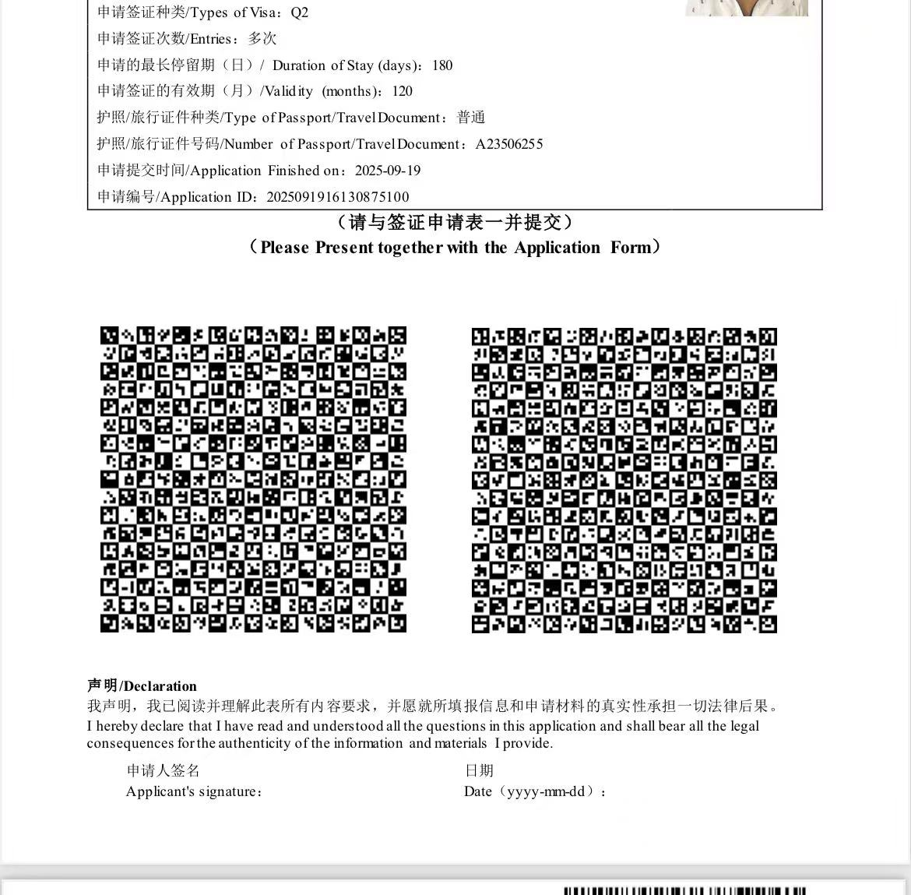

# How to apply Chinese Q2 VISA

## Agent contact
Mag Vacations  
attn: Max Wang  
2145 B South China Place,  
Chicago, IL 60616  
tel: 312-7520898  

## Application cost

芝加哥领事馆的Q2及旅游十年签证费用230刀
(包含140刀签证费，以及填表后审核，代递交，代取，代回邮)

寄件人后面➕益达组，（只是让对方好辨认谁寄来找谁付签证费用而已，没有其它意思），寄出前信封拍照给我，寄出去的信封里放入一份回邮信封（收件人变寄件人）并且付过钱的，回邮信封自己拍照后续跟踪谢谢，快件不要邮寄签收的，投件🎁直接通往公司办公室很安全谢谢🙏

## Application form

Fill out application form [here](https://cova.mfa.gov.cn/qzCoCommonController.do?show&pageId=278VlVYVcVmrHVaV8VmVSVPVKrjVYVlVSVcVbVaVbVSrjrirHVbVSVYVPVlVbV8VbVbVYVaVbrIrIVnVa&locale=zh_CN)

Please save the generated application ID. You can use it together with your passport ID to retrieve the form.
到你填表最后一步提交前，（就是别提交到领事馆去）给我申请号及护照首页，我们工作人员会进入审核无误后提交

## Application check list

1. 美国护照原件+首页复印件1份
2. 申请表原件（首页申请人和 7/7 页9.1申请人都要签）
3. 2015 的10年签证复印件1份
4. 申请人在芝加哥领区的驾照或地址证明信件复印件1份
5. [Where U Stay Form](./files/WhereYouStayForm.pdf)
6. [中国亲属的邀请函](./files/Invitation.pdf)+身份证正反面复印件
7. [申请3年或10年签证声明](./files/VisaCompensationChecklist.pdf)

## FAQ

1. Q: 申请表填错了怎么办？
   A: 在没有提交之前，你可以重新修改，一旦提交，没有办法修改

2. Q: 申请表提交后，多久可以拿到签证？
   A: 一般7-10个工作日

3. Q: 旧的10年签证过期后，申请的时候还需要提交原件吗？
   A: 不需要，旧的10年签证复印件

4. Q: 旧的10年签证在一本旧护照上，申请的时候需要邮寄旧的护照吗？
   A: 不需要，旧的10年签证复印件即可
   

不要忘记提交时在申请表简版的第一页签名

